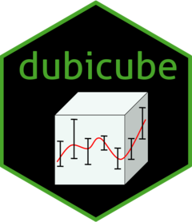

<!-- README.md is generated from README.Rmd. Please edit that file -->

```{r, include = FALSE}
knitr::opts_chunk$set(
  collapse = TRUE,
  comment = "#>",
  fig.path = file.path("man", "figures", "readme-"),
  out.width = "80%",
  dpi = 300
)
```

# dubicube <a href="https://b-cubed-eu.github.io/dubicube/"></a>

<!-- badges: start -->

[](https://www.repostatus.org/#wip)
[](https://github.com/b-cubed-eu/dubicube/releases)
[](https://b-cubed-eu.r-universe.dev/dubicube)
[](https://CRAN.R-project.org/package=dubicube)
[](https://github.com/b-cubed-eu/dubicube/actions/workflows/check_on_different_r_os.yml)
[](https://app.codecov.io/gh/b-cubed-eu/dubicube/)
[](https://doi.org/10.5281/zenodo.14850237)
[](https://b-cubed-eu.r-universe.dev/)

<!-- badges: end -->

The **dubicube** package aims to deliver measures for assessing the applicability of biodiversity data cubes, whether for general use or specific biodiversity indicators. These measures facilitate data exploration by providing insights into data quality and reliability. Additionally, the package includes functions for calculating indicator uncertainty using bootstrapping, as well as tools for interpreting and visualising uncertainty in biodiversity indicators derived from occurrence cubes. 

## Installation

Install **dubicube** in R:

```r
install.packages("dubicube"", repos = c("https://b-cubed-eu.r-universe.dev", "https://cloud.r-project.org"))
```

You can install the development version from [GitHub](https://github.com/) with:

``` r
# install.packages("remotes")
remotes::install_github("b-cubed-eu/dubicube")
```

## Key Features

The **dubicube** package offers:

### 🔍 1. Data Exploration & Variability Assessment

Gain insights into the structure and sensitivity of biodiversity data cubes.

* `cross_validate_cube()`
  Perform cross-validation (leave-one-out or k-fold) to assess group-level sensitivity of indicators and evaluate how individual categories influence results.\
  📘 [Read the tutorial →](https://b-cubed-eu.github.io/dubicube/articles/group-level-sensitivity.html)

> 🛠️ Additional data quality diagnostics are on the way!

### 📈 2. Estimating Indicator Uncertainty

Use bootstrap methods to understand variability, bias, and confidence in your indicators.

* `bootstrap_cube()`
  Create bootstrap replicates to estimate indicator variability, bias, and standard error.\
  📘 [Read the tutorial →](https://b-cubed-eu.github.io/dubicube/articles/bootstrap-method-cubes.html)

* `calculate_bootstrap_ci()`
  Compute confidence intervals (percentile, BCa, normal, basic), with optional transformations and bias correction.\
  📘 [Read the tutorial →](https://b-cubed-eu.github.io/dubicube/articles/bootstrap-interval-calculation.html)

### 🧠 3. Interpretation & Visualisation

Put your results in context with reference values and uncertainty thresholds.

* `add_effect_classification()`
  Classify indicator trends (e.g. increase, stable, decrease) by comparing confidence intervals to thresholds.\
  📘 [Read the tutorial →](https://b-cubed-eu.github.io/dubicube/articles/effect-classification.html)

> 📚 Tutorials on best practices for spatial and temporal interpretation are coming soon!

---

🔗 Learn more at our [website](https://b-cubed-eu.github.io/dubicube/) or explore the [documentation](https://b-cubed-eu.github.io/dubicube/reference/).
