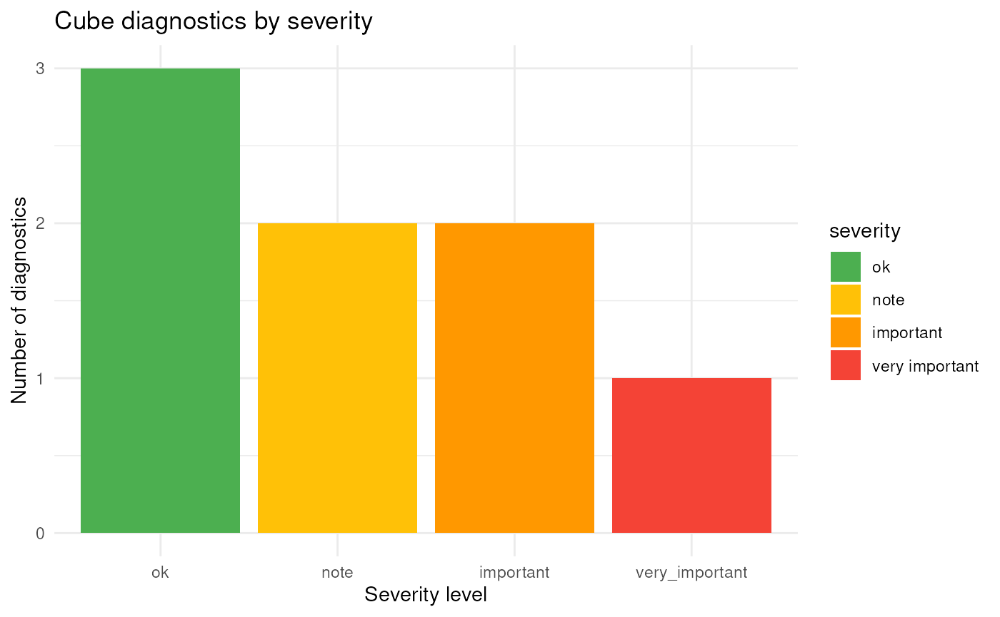
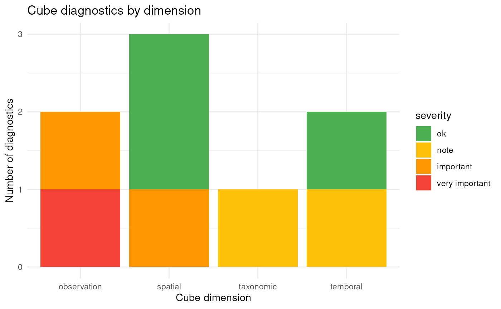
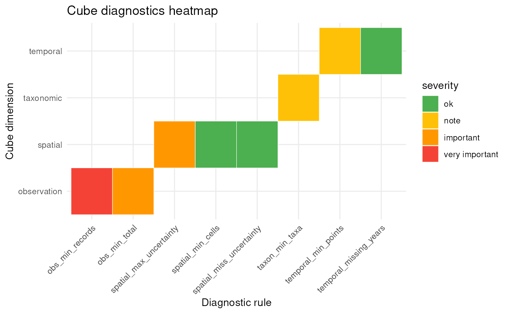

# Data Quality Diagnostics and Filtering for Data Cubes

## Introduction

The **dubicube** package implements a rule-based diagnostic framework to
assess the quality and structural properties of biodiversity data cubes.
Diagnostics are applied across key dimensions of the cube, including
spatial coverage, temporal coverage, taxonomic representation, and
overall observation volume. Each diagnostic is defined as a modular rule
that specifies how a metric is calculated and how its value should be
interpreted.

Diagnostic rules combine three components: a function to compute a
metric from the data cube, a set of threshold values that define
reference ranges, and functions that translate the resulting value into
a qualitative severity level and a human-readable message. This design
ensures that diagnostics are transparent, reproducible, and easily
extendable.

Diagnostics are evaluated using the
[`diagnose_cube()`](https://b-cubed-eu.github.io/dubicube/reference/diagnose_cube.md)
function, which returns a structured overview of data quality. Each
metric is assigned one of four severity levels: **ok**, **note**,
**important**, and **very important**, providing an intuitive summary of
potential data limitations.

In addition to evaluation, **dubicube** supports filtering of
observations based on diagnostic rules. The
[`filter_cube()`](https://b-cubed-eu.github.io/dubicube/reference/filter_cube.md)
function applies rule-specific filtering logic to remove or flag records
that do not meet predefined quality criteria. This filtering step is
optional and allows users to tailor the data cube to their specific
analytical needs.

Together, diagnostics and filtering form a structured and reproducible
workflow for assessing and improving biodiversity data cubes prior to
analysis. Data evaluation and filtering are iterative steps until a
satisfactory cube evaluation is obtained. This final data cube can then
be used for further analysis.


## Data quality checks with `diagnose_cube()`

``` r

library(dubicube)
```

### Running diagnostics

We start by creating a small example data cube that contains a range of
common data quality issues, including limited temporal coverage, large
coordinate uncertainty, and low sample size. Note that this is for
illustrative purposes only, real cubes should be processed with
[`b3gbi::process_cube()`](https://b-cubed-eu.github.io/b3gbi/reference/process_cube.html).

``` r

cube <- list(
  data = data.frame(
    year = c(2000, 2000, 2001, 2001, 2002, 2002, 2003, 2003, 2003),
    cellCode = c("A", "A", "B", "B", "C", "C", "D", "D", "E"),
    taxonKey = c(1, 1, 1, 2, 2, 3, 3, 3, 3),
    obs = c(10, 5, 1, 2, 0, 1, 2, 1, 0),
    minCoordinateUncertaintyInMeters = c(
      50, 100, 2000, 70, 5000, 2000, 10, 20, 300
    )
  ),
  resolutions = "1km"
)
class(cube) <- "processed_cube"
```

We can now evaluate the data quality of this cube using
[`diagnose_cube()`](https://b-cubed-eu.github.io/dubicube/reference/diagnose_cube.md).

``` r

diag <- diagnose_cube(cube)
#> 
#> Data cube diagnostics
#> ----------------------
#> 🟡 NOTE - temporal_min_points 
#>    Cube contains observations across 4 years. 
#> 
#> 🟢 OK - temporal_missing_years 
#>    Cube contains 0 missing years. 
#> 
#> 🟢 OK - spatial_min_cells 
#>    Cube contains observations across 5 grid cells. 
#> 
#> 🟠 IMPORTANT - spatial_max_uncertainty 
#>    Cube contains 3 records where the coordinate uncertainty is larger than the grid cell resolution. 
#> 
#> 🟢 OK - spatial_miss_uncertainty 
#>    Cube contains 0 records with missing coordinate uncertainty. 
#> 
#> 🟡 NOTE - taxon_min_taxa 
#>    Cube contains observations across 3 taxon keys. 
#> 
#> 🔴 VERY_IMPORTANT - obs_min_records 
#>    Cube contains 9 observation records (rows). 
#> 
#> 🟠 IMPORTANT - obs_min_total 
#>    Cube contains a total of 22 observations.
```

By default `verbose = TRUE`, so we get a summary of diagnostic results
directly in the console and the function returns a structured
`cube_diagnostics` object for further inspection.

We can sort the summary with `print`-arguments.

``` r

print(diag, sort_summary = "asc")
#> 
#> Data cube diagnostics
#> ----------------------
#> 🟢 OK - temporal_missing_years 
#>    Cube contains 0 missing years. 
#> 
#> 🟢 OK - spatial_min_cells 
#>    Cube contains observations across 5 grid cells. 
#> 
#> 🟢 OK - spatial_miss_uncertainty 
#>    Cube contains 0 records with missing coordinate uncertainty. 
#> 
#> 🟡 NOTE - temporal_min_points 
#>    Cube contains observations across 4 years. 
#> 
#> 🟡 NOTE - taxon_min_taxa 
#>    Cube contains observations across 3 taxon keys. 
#> 
#> 🟠 IMPORTANT - spatial_max_uncertainty 
#>    Cube contains 3 records where the coordinate uncertainty is larger than the grid cell resolution. 
#> 
#> 🟠 IMPORTANT - obs_min_total 
#>    Cube contains a total of 22 observations. 
#> 
#> 🔴 VERY_IMPORTANT - obs_min_records 
#>    Cube contains 9 observation records (rows).
```

We can also filter the summary output based on a minimum severity level.

``` r

print(diag, sort_summary = "asc", filter_summary = "note")
#> 
#> Data cube diagnostics
#> ----------------------
#> 🟡 NOTE - temporal_min_points 
#>    Cube contains observations across 4 years. 
#> 
#> 🟡 NOTE - taxon_min_taxa 
#>    Cube contains observations across 3 taxon keys. 
#> 
#> 🟠 IMPORTANT - spatial_max_uncertainty 
#>    Cube contains 3 records where the coordinate uncertainty is larger than the grid cell resolution. 
#> 
#> 🟠 IMPORTANT - obs_min_total 
#>    Cube contains a total of 22 observations. 
#> 
#> 🔴 VERY_IMPORTANT - obs_min_records 
#>    Cube contains 9 observation records (rows).
```

### Understanding the output

The output object of is an object of class `cube_diagnostics`,
containing one row per metric with the following columns:

- dimension: Dimension of the cube being evaluated (e.g. `"spatial"`,
  `"temporal"`, `"taxonomical"`).
- metric: The diagnostic rule that was evaluated.
- value: Computed metric value.
- severity: Severity level (“ok”, “note”, “important”,
  “very_important”).
- message: Human-readable description of the diagnostic result.

``` r

diag$dimension
#> [1] "temporal"    "temporal"    "spatial"     "spatial"     "spatial"    
#> [6] "taxonomic"   "observation" "observation"
```

``` r

diag$metric
#> [1] "temporal_min_points"      "temporal_missing_years"  
#> [3] "spatial_min_cells"        "spatial_max_uncertainty" 
#> [5] "spatial_miss_uncertainty" "taxon_min_taxa"          
#> [7] "obs_min_records"          "obs_min_total"
```

The rule objects are attached as an attribute of the diagnostics object.

The severity levels provide a quick way to assess potential data
limitations:

- **ok**: No issues detected
- **note**: Minor limitations
- **important**: Issues that may influence analysis
- **very important**: Serious limitations that may affect reliability

### Summarising diagnostics

To obtain a concise overview of the results, you can use the
[`summary()`](https://rdrr.io/r/base/summary.html) method:

``` r

summary(diag)
#> <cube_diagnostics_summary>
#> 
#> Rules evaluated: 8 
#> 
#> Severity levels:
#>      important           note             ok very_important 
#>              2              2              3              1 
#> 
#> Dimensions:
#> observation     spatial   taxonomic    temporal 
#>           2           3           1           2 
#> 
#> Flagged diagnostics:
#> 
#> Data cube diagnostics
#> ----------------------
#> 🟡 NOTE - temporal_min_points 
#>    Cube contains observations across 4 years. 
#> 
#> 🟡 NOTE - taxon_min_taxa 
#>    Cube contains observations across 3 taxon keys. 
#> 
#> 🟠 IMPORTANT - spatial_max_uncertainty 
#>    Cube contains 3 records where the coordinate uncertainty is larger than the grid cell resolution. 
#> 
#> 🟠 IMPORTANT - obs_min_total 
#>    Cube contains a total of 22 observations. 
#> 
#> 🔴 VERY_IMPORTANT - obs_min_records 
#>    Cube contains 9 observation records (rows).
```

This helps to quickly identify which aspects of the data cube may
require attention before proceeding with analysis.

Optionally, diagnostics can also be visualised:

``` r

plot(diag)
```



This provides a graphical summary of diagnostic results across severity
levels and cube dimensions. The diagnostics can also be plotted by
dimension or as a heat map:

``` r

plot(diag, type = "dimension")
```



``` r

plot(diag, type = "heatmap")
```



### Selecting diagnostic rules to evaluate

By default,
[`diagnose_cube()`](https://b-cubed-eu.github.io/dubicube/reference/diagnose_cube.md)
uses the basic rules to evaluate.

``` r

basic_cube_rules()
#> <cube_rule_list>
#>   rules: 8 
#> 
#>   - temporal_min_points ( temporal )
#>   - temporal_missing_years ( temporal )
#>   - spatial_min_cells ( spatial )
#>   - spatial_max_uncertainty ( spatial )
#>   - spatial_miss_uncertainty ( spatial )
#>   - taxon_min_taxa ( taxonomic )
#>   - obs_min_records ( observation )
#>   - obs_min_total ( observation )
```

You can refer to built-in rule sets with a string, you can provide a
list of `cube_rule` object or combine both.

``` r

diagnose_cube(cube, rules = "basic")
#> 
#> Data cube diagnostics
#> ----------------------
#> 🟡 NOTE - temporal_min_points 
#>    Cube contains observations across 4 years. 
#> 
#> 🟢 OK - temporal_missing_years 
#>    Cube contains 0 missing years. 
#> 
#> 🟢 OK - spatial_min_cells 
#>    Cube contains observations across 5 grid cells. 
#> 
#> 🟠 IMPORTANT - spatial_max_uncertainty 
#>    Cube contains 3 records where the coordinate uncertainty is larger than the grid cell resolution. 
#> 
#> 🟢 OK - spatial_miss_uncertainty 
#>    Cube contains 0 records with missing coordinate uncertainty. 
#> 
#> 🟡 NOTE - taxon_min_taxa 
#>    Cube contains observations across 3 taxon keys. 
#> 
#> 🔴 VERY_IMPORTANT - obs_min_records 
#>    Cube contains 9 observation records (rows). 
#> 
#> 🟠 IMPORTANT - obs_min_total 
#>    Cube contains a total of 22 observations.
```

> More built-in rule sets will be available soon

If you provide a list of rule objects, you can also change the
thresholds for the severity values.

``` r

diagnose_cube(
  cube,
  rules = list(
    rule_temporal_missing_years(),
    rule_spatial_max_uncertainty(
      thresholds = c(ok = 0, note = 1, important = 2, very_important = 3)
    ),
    rule_taxon_min_taxa()
  ),
  sort_summary = "asc"
)
#> 
#> Data cube diagnostics
#> ----------------------
#> 🟢 OK - temporal_missing_years 
#>    Cube contains 0 missing years. 
#> 
#> 🟡 NOTE - taxon_min_taxa 
#>    Cube contains observations across 3 taxon keys. 
#> 
#> 🔴 VERY_IMPORTANT - spatial_max_uncertainty 
#>    Cube contains 3 records where the coordinate uncertainty is larger than the grid cell resolution.
```

## Filtering based on diagnostics with `filter_cube()`

After the diagnostic evaluation we might want to generate a new data
cube, or we might want to filter the data. Some `cube_rule` objects have
`filter_fn()` functions that return a logical vector indicating which
rows should be removed. For the basic rule set,
[`rule_spatial_max_uncertainty()`](https://b-cubed-eu.github.io/dubicube/reference/rule_spatial_max_uncertainty.md)
and
[`rule_spatial_miss_uncertainty()`](https://b-cubed-eu.github.io/dubicube/reference/rule_spatial_miss_uncertainty.md).
They will filter out respectively rows with minimal coordinate
uncertainty larger than the grid cell resolution, and rows with missing
minimal coordinate uncertainty.

We can pass the `"cube_diagnostics"` object. Only rules that implement a
`filter_fn()` will be applied. Rules without a filtering function are
ignored. **dubicube** will try to process the cube again with **b3gbi**.
This will not work in our case since we never started with a processed
cube to begin with (for illustrative reasons only).

``` r

filtered_cube <- filter_cube(cube, diagnostics = diag)
#> Warning: Filtered data replaced the cube data but metadata was not recomputed.
#> Install and use `b3gbi::process_cube()` to rebuild cube metadata.
```

We see that the data with minimal coordinate uncertainty larger than the
grid cell resolution (= 1000 m) are removed.

``` r

cube$data
#>   year cellCode taxonKey obs minCoordinateUncertaintyInMeters
#> 1 2000        A        1  10                               50
#> 2 2000        A        1   5                              100
#> 3 2001        B        1   1                             2000
#> 4 2001        B        2   2                               70
#> 5 2002        C        2   0                             5000
#> 6 2002        C        3   1                             2000
#> 7 2003        D        3   2                               10
#> 8 2003        D        3   1                               20
#> 9 2003        E        3   0                              300
```

``` r

filtered_cube$data
#>   year cellCode taxonKey obs minCoordinateUncertaintyInMeters
#> 1 2000        A        1  10                               50
#> 2 2000        A        1   5                              100
#> 4 2001        B        2   2                               70
#> 7 2003        D        3   2                               10
#> 8 2003        D        3   1                               20
#> 9 2003        E        3   0                              300
```

You can also use the rules directly for filtering.

``` r

filtered_cube2 <- filter_cube(
  cube,
  rules = list(rule_spatial_max_uncertainty())
)
#> Warning: Filtered data replaced the cube data but metadata was not recomputed.
#> Install and use `b3gbi::process_cube()` to rebuild cube metadata.
```

``` r

identical(filtered_cube, filtered_cube2)
#> [1] TRUE
```

## Create your own rules (coming soon)

Custom diagnostic and filtering rules will be supported in a future
release of **dubicube**. This will allow users to define their own
diagnostic metrics.
