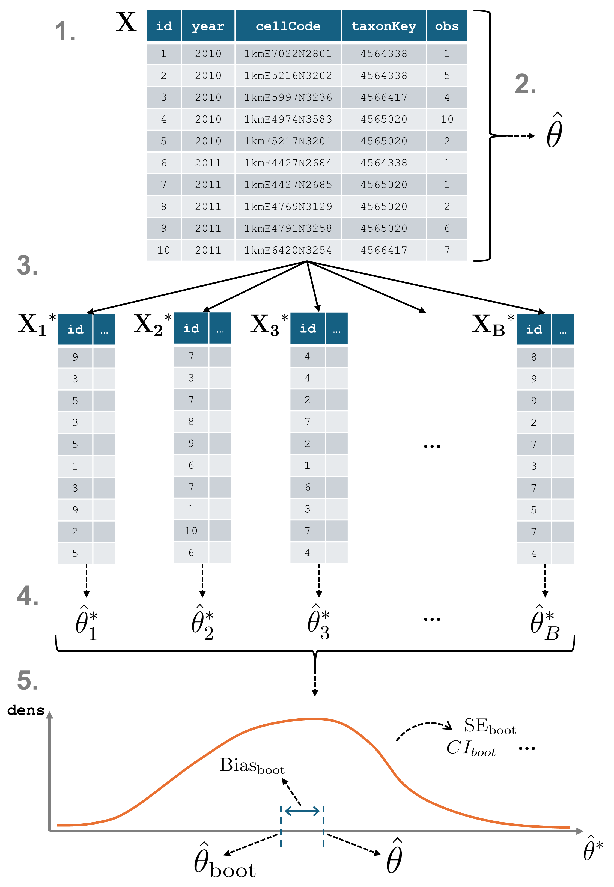

```{r, include = FALSE}
knitr::opts_chunk$set(
  collapse = TRUE,
  comment = "#>"
)
```

## Introduction

When working with data cubes, it’s essential to understand the uncertainty surrounding derived statistics. This tutorial introduces the `bootstrap_cube()` function from **dubicube**,  which uses bootstrap resampling to estimate the variability, bias, and standard error of estimates.

## Bootstrapping for data cubes

Bootstrapping is a resampling method used to approximate the distribution of a statistic by repeatedly sampling from the data with replacement. In the context of biodiversity data cubes, `bootstrap_cube()` enables us to assess the variability of derived statistics, such as by computing confidence intervals.

Note that we also make a distinction between whole-cube bootstrapping and group-specific bootstrapping. This is further explained in [this tutorial](https://b-cubed-eu.github.io/dubicube/articles/whole-cube-versus-group-specific-bootstrap.html).

### A data cube and a statistic

Consider a data cube $\mathbf{X}$ from which we want to calculate a statistic $\theta$.

- **Original Sample Data**: $\mathbf{X} = \{X_1, X_2, \ldots, X_n\}$  
   - The initial set of data points. Here, $n$ is the sample size.
   This corresponds to the number of cells in a data cube or the number of rows in tabular format.

- **Statistic of Interest**: $\theta$  
   - The parameter or statistic being estimated, such as the mean $\bar{X}$, variance $\sigma^2$, or a biodiversity indicator.
   Let $\hat{\theta}$ denote the estimated value of $\theta$ calculated from the complete dataset $\mathbf{X}$.

### Resampling and recalculating

From $\mathbf{X}$, multiple resampled datasets $\mathbf{X}^*$ are created by sampling rows (cells) with replacement until each new dataset is equally large as $\mathbf{X}$.
This process is repeated $B$ times, and each resample yields a new estimate $\hat{\theta}^*_b$ of the statistic.

- **Bootstrap Sample**: $\mathbf{X}^* = \{X_1^*, X_2^*, \ldots, X_n^*\}$
   - A sample of size $n$ drawn with replacement from the original sample
   $\mathbf{X}$. Each $X_i^*$ is drawn independently from
   $\mathbf{X}$.
   - A total of $B$ bootstrap samples are drawn from the original data.
   Common choices for $B$ are 1000 or 10,000 to ensure a good
   approximation of the distribution of the bootstrap replications (see
   further).

- **Bootstrap Replication**: $\hat{\theta}^*_b$
   - The value of the statistic of interest calculated from the $b$-th
   bootstrap sample $\mathbf{X}^*_b$. For example, if $\theta$ is
   the sample mean, $\hat{\theta}^*_b = \bar{X}^*_b$.

### Derivation of bootstrap statistics

The set of bootstrap replications forms the bootstrap distribution, which can be used to estimate bootstrap statistics and construct confidence intervals (see the [interval calculation tutorial](https://b-cubed-eu.github.io/dubicube/articles/bootstrap-interval-calculation.html)).

- **Bootstrap Estimate of the Statistic**: $\hat{\theta}_{\text{boot}}$
  - The average of the bootstrap replications:

$$
\hat{\theta}_{\text{boot}} = \frac{1}{B} \sum_{b=1}^B \hat{\theta}^*_b
$$

- **Bootstrap Bias**: $\text{Bias}_{\text{boot}}$
   - This bias indicates how much the bootstrap estimate deviates from the
   original sample estimate. It is calculated as the difference between the
   average bootstrap estimate and the original estimate:

$$
\text{Bias}_{\text{boot}} = \frac{1}{B} \sum_{b=1}^B (\hat{\theta}^*_b - \hat{\theta}) = \hat{\theta}_{\text{boot}} - \hat{\theta}
$$

- **Bootstrap Standard Error**: $\text{SE}_{\text{boot}}$
   - The standard deviation of the bootstrap replications, which estimates
   the variability of the statistic.



## Getting started with dubicube

The **dubicube** bootstrapping method can be used on any dataframe from which a statistic is calculated and a grouping variable is present.
For this tutorial, we focus on occurrence cubes.
Therefore, we will use the **b3gbi** package for processing the raw data before moving on to the bootstrapping.

```{r, message=FALSE, warning=FALSE}
# Load packages
library(ggplot2)      # Data visualisation
library(dplyr)        # Data wrangling
library(tidyr)        # Data wrangling

# Data loading and processing
library(frictionless) # Load example datasets
library(b3gbi)        # Process occurrence cubes
library(dubicube)     # Analysis of data quality & indicator uncertainty
```

### Loading and processing the data

We load the bird cube data from the **b3data** data package using **frictionless** (see also [here](https://github.com/b-cubed-eu/b3data-scripts)).
It is an occurrence cube for birds in Belgium between 2000 en 2024 using the MGRS grid at 10 km scale.

```{r}
# Read data package
b3data_package <- read_package(
  "https://zenodo.org/records/15211029/files/datapackage.json"
)

# Load bird cube data
bird_cube_belgium <- read_resource(b3data_package, "bird_cube_belgium_mgrs10")
head(bird_cube_belgium)
```

We process the cube with **b3gbi**.
First, we select 2000 random rows to make the dataset smaller.
This is to reduce the computation time for this tutorial.
We select the data from 2011 - 2020.

```{r}
set.seed(123)

# Make dataset smaller
rows <- sample(nrow(bird_cube_belgium), 2000)
bird_cube_belgium <- bird_cube_belgium[rows, ]

# Process cube
processed_cube <- process_cube(
  bird_cube_belgium,
  first_year = 2011,
  last_year = 2020,
  cols_occurrences = "n"
)
processed_cube
```

### Analysis of the data

Let's say we are interested in the mean number of observations per grid cell per year.
We create a function to calculate this.

```{r}
# Function to calculate the statistic of interest
# Mean observations per grid cell per year
mean_obs <- function(data) {
  obs <- x <- NULL

  data %>%
    dplyr::mutate(x = mean(obs), .by = "cellCode") %>%
    dplyr::summarise(diversity_val = mean(x), .by = "year") %>%
    as.data.frame()
}
```

We get the following results:

```{r}
mean_obs(processed_cube$data)
```

On their own, these values don’t reveal how much uncertainty surrounds them. To better understand their variability, we use bootstrapping to estimate the distribution of the yearly means.

### Bootstrapping

We use the `bootstrap_cube()` function to do this. It relies on the following arguments:

- **`data_cube`**:  
  The input data as a processed data cube (from `b3gbi::process_cube()`).

- **`fun`**:  
  A user-defined function that computes the statistic(s) of interest from `data_cube$data`. This function should return a dataframe that includes a column named `diversity_val`, containing the statistic to evaluate.

- **`grouping_var`**:  
  The column(s) used for grouping the output of `fun()`. For example, if `fun()` returns one value per year, use `grouping_var = "year"`.

- **`samples`**:  
  The number of bootstrap samples to draw. Common values are 1000 or more for reliable estimates of variability and confidence intervals.

- **`seed`**:  
  An optional numeric seed to ensure reproducibility of the bootstrap resampling. Set this to a fixed value to get consistent results across runs.

- **`progress`**:  
  Logical flag to show a progress bar. Set to `TRUE` to enable progress reporting; default is `FALSE`.

```{r}
bootstrap_results <- bootstrap_cube(
  data_cube = processed_cube,
  fun = mean_obs,
  grouping_var = "year",
  samples = 1000,
  seed = 123
)
```

```{r}
head(bootstrap_results)
```

We can visualise the bootstrap distributions using a violin plot.

```{r, warning=FALSE}
#| fig.alt: >
#|   Bootstrap distributions for mean number of occurrences over time.
# Get bias vales
bias_mean_obs <- bootstrap_results %>%
  distinct(year, estimate = est_original, `bootstrap estimate` = est_boot)

# Get estimate values
estimate_mean_obs <- bias_mean_obs %>%
  pivot_longer(cols = c("estimate", "bootstrap estimate"),
               names_to = "Legend", values_to = "value") %>%
  mutate(Legend = factor(Legend, levels = c("estimate", "bootstrap estimate"),
                         ordered = TRUE))

# Visualise bootrap distributions
bootstrap_results %>%
  ggplot(aes(x = year)) +
  # Distribution
  geom_violin(aes(y = rep_boot, group = year),
              fill = alpha("cornflowerblue", 0.2)) +
  # Estimates and bias
  geom_point(data = estimate_mean_obs, aes(y = value, shape = Legend),
             colour = "firebrick", size = 2.5) +
  # Settings
  labs(y = "Mean Number of Observations\nper Grid Cell",
       x = "", shape = "Legend:") +
  scale_x_continuous(breaks = sort(unique(bootstrap_results$year))) +
  theme_minimal() +
  theme(legend.position = "bottom",
        legend.title = element_text(face = "bold"))
```

## Advanced usage of `bootstrap_cube()`
### Bootstrap simple dataframes

As stated in the documentation, it is also possible to bootstrap a dataframe.
In this case, set the argument `processed_cube = FALSE`.
This is implemented to allow for flexible use of simple dataframes, while still encouraging the use of `b3gbi::process_cube()` as default functionality.

```r
bootstrap_results_df <- bootstrap_cube(
  data_cube = processed_cube$data,      # data.frame object
  fun = mean_obs,
  grouping_var = "year",
  samples = 1000,
  seed = 123,
  processed_cube = FALSE
)
```

### Comparison with a reference group

A particularly insightful approach is comparing indicator values to a reference group. In time series analyses, this often means comparing each year’s indicator to a baseline year (e.g., the first or last year in the series).

To do this, we perform bootstrapping over the differences between indicator values:

1. Resample the dataset with replacement  
2. Calculate the indicator for each group (e.g., each year)  
3. For each non-reference group, compute the difference between its indicator value and that of the reference group  
4. Repeat steps 1–3 across all bootstrap iterations  

This process yields bootstrap replicate distributions of differences in indicator values.

```{r}
bootstrap_results_ref <- bootstrap_cube(
  data_cube = processed_cube,
  fun = mean_obs,
  grouping_var = "year",
  samples = 1000,
  ref_group = 2011,
  seed = 123
)
```

```{r}
head(bootstrap_results_ref)
```

We see that the mean number of observations is higher in most years compared to 2011.
At what point can we say these differences are significant?
This will be further explored in the [effect classification tutorial](https://b-cubed-eu.github.io/dubicube/articles/effect-classification.html).

```{r, warning=FALSE}
#| fig.alt: >
#|   Bootstrap distributions for mean number of occurrences over time (ref).
# Get bias vales
bias_mean_obs <- bootstrap_results_ref %>%
  distinct(year, estimate = est_original, `bootstrap estimate` = est_boot)

# Get estimate values
estimate_mean_obs <- bias_mean_obs %>%
  pivot_longer(cols = c("estimate", "bootstrap estimate"),
               names_to = "Legend", values_to = "value") %>%
  mutate(Legend = factor(Legend, levels = c("estimate", "bootstrap estimate"),
                         ordered = TRUE))

# Visualise bootrap distributions
bootstrap_results_ref %>%
  ggplot(aes(x = year)) +
  # Distribution
  geom_violin(aes(y = rep_boot, group = year),
              fill = alpha("cornflowerblue", 0.2)) +
  # Estimates and bias
  geom_point(data = estimate_mean_obs, aes(y = value, shape = Legend),
             colour = "firebrick", size = 2) +
  # Settings
  labs(y = "Mean Number of Observations per Grid Cell\nCompared to 2011",
       x = "", shape = "Legend:") +
  scale_x_continuous(breaks = sort(unique(bootstrap_results_ref$year))) +
  theme_minimal() +
  theme(legend.position = "bottom",
        legend.title = element_text(face = "bold"))
```

Note that the choice of the reference year should be well considered.
Keep in mind which comparisons should be made, and what the motivation is behind the reference period.
A high or low value in the reference period relative to other periods, e.g. an exceptional bad or good year, can affect the magnitude and direction of the calculated differences.
Whether this should be avoided or not, depends on the motivation behind the choice and the research question.
A reference period can be determined by legislation, or by the start of a monitoring campaign.
A specific research question can determine the periods that need to be compared.
Furthermore, the variability of the estimate of reference period affects the width of confidence intervals for the differences.
A more variable reference period will propagate greater uncertainty.
In the case of GBIF data, more data will be available in recent years than in earlier years.
If this is the case, it could make sense to select the last period as a reference period.
In a way, this also avoids the arbitrariness of choosing the reference period.
You compare previous situations with the current situation (last year), where you could repeat this comparison annually, for example.
Finally, when comparing multiple indicators, we recommend using a consistent reference period to maintain comparability.

### Bootstrap Method

The bootstrap method in **dubicube** can be performed in different ways depending on the structure of your data and the indicator of interest. There are two main approaches which are compared in more detail in [this tutorial](https://b-cubed-eu.github.io/dubicube/articles/whole-cube-versus-group-specific-bootstrap.html).

1. **Whole-cube bootstrapping** (`method = "whole_cube"`)
   In this method, resampling is performed across all rows in the cube, ignoring any grouping variables. This is appropriate when the statistic of interest uses data from multiple groups simultaneously, such as overall biodiversity measures or aggregated metrics that combine multiple species, years, or locations.

2. **Group-specific bootstrapping** (`method = "group_specific"`)
   Here, resampling occurs only within each group defined by the grouping variable (e.g., species, year, or habitat). This is suitable for indicators calculated independently for each group, where maintaining the group structure is essential for a meaningful estimate of variability.

The smart option (`method = "smart"`, default) lets **dubicube** automatically choose the most suitable approach. It does so by comparing indicator values calculated on larger versus smaller subsets of the data, checking whether the common groups yield identical results. If so, group-specific bootstrapping is applied; otherwise, whole-cube bootstrapping is used.

Additionally, there is an experimental option (`method = "boot"`) that uses the `boot::boot()` function from the **boot** package. This allows for advanced bootstrapping techniques but is still under development.
