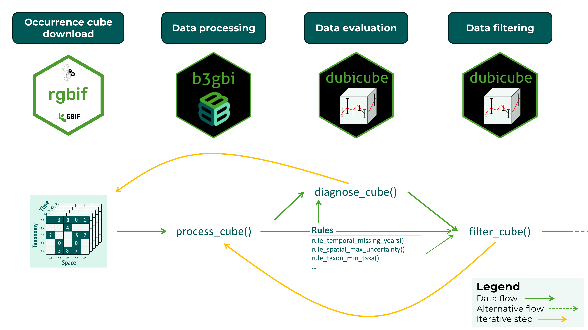

```{r, include = FALSE}
knitr::opts_chunk$set(
  collapse = TRUE,
  comment = "#>"
)
```

## Introduction

The **dubicube** package implements a rule-based diagnostic framework to assess the quality and structural properties of biodiversity data cubes. Diagnostics are applied across key dimensions of the cube, including spatial coverage, temporal coverage, taxonomic representation, and overall observation volume. Each diagnostic is defined as a modular rule that specifies how a metric is calculated and how its value should be interpreted.

Diagnostic rules combine three components: a function to compute a metric from the data cube, a set of threshold values that define reference ranges, and functions that translate the resulting value into a qualitative severity level and a human-readable message. This design ensures that diagnostics are transparent, reproducible, and easily extendable.

Diagnostics are evaluated using the `diagnose_cube()` function, which returns a structured overview of data quality. Each metric is assigned one of four severity levels: **ok**, **note**, **important**, and **very important**, providing an intuitive summary of potential data limitations.

In addition to evaluation, **dubicube** supports filtering of observations based on diagnostic rules. The `filter_cube()` function applies rule-specific filtering logic to remove or flag records that do not meet predefined quality criteria. This filtering step is optional and allows users to tailor the data cube to their specific analytical needs.

Together, diagnostics and filtering form a structured and reproducible workflow for assessing and improving biodiversity data cubes prior to analysis. Data evaluation and filtering are iterative steps until a satisfactory cube evaluation is obtained. This final data cube can then be used for further analysis.



## Data quality checks with `diagnose_cube()`
### Running diagnostics

### Understanding the output

### Summarising diagnostics

## Filtering based on diagnostics with `filter_cube()`
### Applying filtering rules

### Using diagnostics as input

### Inspecting the result

## Create your own rules (coming soon)

Custom diagnostic and filtering rules will be supported in a future release of **dubicube**.
This will allow users to define their own diagnostic metrics.
