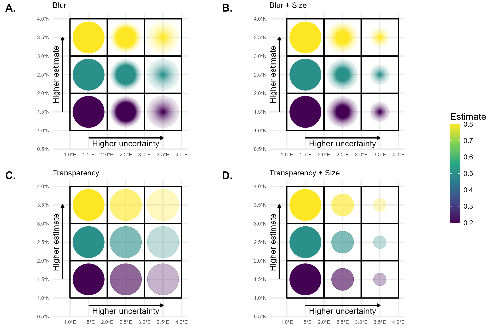

```{r, include = FALSE}
knitr::opts_chunk$set(
  collapse = TRUE,
  comment = "#>"
)
```

## Introduction

This tutorial provides good practices regarding visualisation and interpretation of trends of indicators in space.
The methods discussed here are more broadly applicable, be for this tutorial we focus on occurrence cubes from which biodiversity indicators are derived.

## Calculating confidence intervals with dubicube

We reuse the example introduced in [bootstrap confidence interval calculation tutorial](https://b-cubed-eu.github.io/dubicube/articles/bootstrap-method-cubes.html) where we look at an occurrence cube of birds in Belgium between 2000 en 2024 using the MGRS grid at 10 km scale. We calculate confidence limits for the mean number of observations per grid cell.

```{r, message=FALSE, warning=FALSE}
# Load packages
library(ggplot2)      # Data visualisation
library(dplyr)        # Data wrangling
library(sf)           # Work with spatial objects

# Data loading and processing
library(frictionless) # Load example datasets
library(b3gbi)        # Process occurrence cubes
library(dubicube)     # Analysis of data quality & indicator uncertainty
```

### Loading and processing the data

We load the bird cube data from the **b3data** data package using **frictionless** (see also [here](https://github.com/b-cubed-eu/b3data-scripts)).

```{r}
# Read data package
b3data_package <- read_package(
  "https://zenodo.org/records/15211029/files/datapackage.json"
)

# Load bird cube data
bird_cube_belgium <- read_resource(b3data_package, "bird_cube_belgium_mgrs10")
head(bird_cube_belgium)
```

We process the cube with **b3gbi**.
First, we select 3000 random rows to make the dataset smaller.
We only keep grid cells with more then 10 entries.
This is to reduce the computation time for this tutorial.

```{r}
set.seed(123)

# Make dataset smaller
rows <- sample(nrow(bird_cube_belgium), 3000)
bird_cube_belgium <- bird_cube_belgium[rows, ] %>%
  mutate(n_obs = n(), .by = "mgrscode") %>%
  filter(n_obs > 10) %>%
  select(-n_obs)

# Process cube
processed_cube <- process_cube(
  bird_cube_belgium,
  cols_occurrences = "n"
)
processed_cube
```

### Analysis of the data

Let's say we are interested in the mean number of observations per grid cell.
We create a function to calculate this.

```{r, echo=FALSE}
# nolint start: object_usage_linter.
```

```{r}
# Function to calculate statistic of interest
# Mean observations per grid cell
mean_obs_grid <- function(data) {
  data %>%
    dplyr::summarise(diversity_val = mean(obs), .by = "cellCode") %>%
    as.data.frame()
}
```

```{r, echo=FALSE}
# nolint end
```

We get the following results:

```{r}
head(
  mean_obs_grid(processed_cube$data)
)
```

On their own, these values don’t reveal how much uncertainty surrounds them. To better understand their variability, we use bootstrapping to estimate the distribution of the yearly means. From this, we can calculate bootstrap confidence intervals.

### Bootstrapping

We use the `bootstrap_cube()` function to perform bootstrapping (see also the [bootstrap tutorial](https://b-cubed-eu.github.io/dubicube/articles/bootstrap-method-cubes.html)).

```{r}
bootstrap_results <- bootstrap_cube(
  data_cube = processed_cube,
  fun = mean_obs_grid,
  grouping_var = "cellCode",
  samples = 1000,
  seed = 123
)
```

```{r}
head(bootstrap_results)
```

### Interval calculation

Now we can use the `calculate_bootstrap_ci()` function to calculate confidence limits (see also the [bootstrap confidence interval calculation tutorial](https://b-cubed-eu.github.io/dubicube/articles/bootstrap-method-cubes.html)).
We get a warning message for BCa calculation because we are using a relatively small dataset.

```{r}
ci_mean_obs <- calculate_bootstrap_ci(
  bootstrap_samples_df = bootstrap_results,
  grouping_var = "cellCode",
  type = c("perc", "bca", "norm", "basic"),
  conf = 0.95,
  data_cube = processed_cube,   # Required for BCa
  fun = mean_obs_grid           # Required for Bca
)

# Make interval type factor
ci_mean_obs <- ci_mean_obs %>%
  mutate(
    int_type = factor(
      int_type, levels = c("perc", "bca", "norm", "basic")
    )
  )
```
  
```{r}
head(ci_mean_obs)
```

## Visualising uncertainty in spatial trends

We can visualise the estimate and confidence levels in separate figures.

```{r}
# Read MGRS grid from repository
mgrs10_belgium <- st_read(
  "https://zenodo.org/records/15211029/files/mgrs10_refgrid_belgium.gpkg",
  quiet = TRUE
)

# Get BCa intervals
bca_mean_obs <- ci_mean_obs %>%
  filter(int_type == "bca") %>%
  # Add MGRS grid
  left_join(mgrs10_belgium, by = join_by(cellCode == mgrscode)) %>%
  st_sf(sf_column_name = "geom", crs = st_crs(mgrs10_belgium))
```

```{r}
#| fig.alt: >
#|   Estimates for mean number of occurrences per grid cell.
# Visualise estimates
bca_mean_obs %>%
  # Visualise result
  ggplot() +
  geom_sf(data = mgrs10_belgium) +
  geom_sf(aes(fill = est_original)) +
  # Settings
  scale_fill_viridis_c(option = "D") +
  labs(title = "Estimate", fill = "Legend") +
  theme_minimal()
```

```{r}
#| fig.alt: >
#|   Lower CI's for mean number of occurrences per grid cell.
# Visualise lower CI's
bca_mean_obs %>%
  # Visualise result
  ggplot() +
  geom_sf(data = mgrs10_belgium) +
  geom_sf(aes(fill = ll)) +
  # Settings
  scale_fill_viridis_c(option = "D") +
  labs(title = "Lower confidence limit", fill = "Legend") +
  theme_minimal()
```

```{r}
#| fig.alt: >
#|   Upper CI's for mean number of occurrences per grid cell.
# Visualise upper CI's
bca_mean_obs %>%
  # Visualise result
  ggplot() +
  geom_sf(data = mgrs10_belgium) +
  geom_sf(aes(fill = ul)) +
  # Settings
  scale_fill_viridis_c(option = "D") +
  labs(title = "Upper confidence limit", fill = "Legend") +
  theme_minimal()
```

If we want to visualise estimates and uncertainty in a single figure, we need a good uncertainty measure.
One straightforward option is the width of the confidence interval (CI):

$$
\text{CI width} = \text{upper limit} - \text{lower limit}
$$

This directly reflects the uncertainty — wider intervals indicate greater uncertainty.

To allow for comparisons across spatial units with different magnitudes, we may prefer a relative measure of uncertainty such as the relative CI half-width, calculated as:

$$
\frac{\text{CI width}}{2 \times \text{estimate}}
$$

This expresses the margin of error as a proportion of the estimate, which is easier to interpret. For example, a value of 0.1 implies ±10% uncertainty around the point estimate (assuming symmetric intervals).

Alternatively, we can use the bootstrap standard error as a measure of uncertainty. Similar to CI width, it can be expressed in absolute or relative terms (e.g., standard error divided by the estimate) depending on whether you want to visualise raw or normalized uncertainty.

| Measure                | Formula                      | Description                              |
| ---------------------- | ---------------------------- | -----------------------------------------|
| CI width               | `ul - ll`                    | Absolute uncertainty                     |
| Relative CI width      | `(ul - ll) / estimate`       | Total CI width scaled by estimate        |
| Relative CI half-width | `(ul - ll) / (2 × estimate)` | Margin of error relative to estimate     |
| Bootstrap SE           | `sd(bootstrap replicates)`   | Standard deviation of bootstrap samples  |
| Relative bootstrap SE  | `sd(...) / estimate`         | Standard error relative to estimate      |

For visualising both the estimate and uncertainty in a single map, we can use circles within the grid cells that vary in transparency (best w.r.t. user performance ~ accuracy, speed), or in blurriness (best w.r.t. user intuitiveness) (Kinkeldey et al., 2014; MacEachren et al., 2005, 2012).

### Transparency

Let's visualise the relative half-width where we use a larger transparency for larger uncertainty.
Transparency can be scaled using the `scale_alpha()` function from **ggplot2**.

```{r, warning=FALSE}
#| fig.alt: >
#|   Spatial uncertainty using transparency.
# Calculate center points
st_centroid(bca_mean_obs) %>%
  mutate(x = st_coordinates(geom)[, 1],
         y = st_coordinates(geom)[, 2],
         # Calculate uncertainty measure
         uncertainty = (ul - ll) /  (2 * est_original)) %>%
  # Visualise
  ggplot() +
  geom_sf(data = mgrs10_belgium) +
  geom_point(
    aes(x = x, y = y, colour = est_original, alpha = uncertainty),
    size = 5
  ) +
  # Settings
  scale_colour_viridis_c(option = "D") +
  scale_alpha(range = c(1, 0.3)) +    # Scale accordingly
  labs(colour = "Estimate", alpha = "Uncertainty",
       x = "", y = "") +
  theme_minimal()
```

To make the visualisation even more clear, we can also vary size based on the uncertainty measure.
Size can be scaled using the `scale_size()` function from **ggplot2**.

```{r, warning=FALSE}
#| fig.alt: >
#|   Spatial uncertainty using transparency and size.
# Calculate center points
st_centroid(bca_mean_obs) %>%
  mutate(x = st_coordinates(geom)[, 1],
         y = st_coordinates(geom)[, 2],
         # Calculate uncertainty measure
         uncertainty = (ul - ll) /  (2 * est_original)) %>%
  # Visualise
  ggplot() +
  geom_sf(data = mgrs10_belgium) +
  geom_point(
    aes(x = x, y = y, colour = est_original, alpha = uncertainty,
        size = uncertainty)
  ) +
  # Settings
  scale_colour_viridis_c(option = "D") +
  scale_alpha(range = c(1, 0.3)) +    # Scale accordingly
  scale_size(range = c(5, 2)) +       # Scale accordingly
  labs(colour = "Estimate", alpha = "Uncertainty", size = "Uncertainty",
       x = "", y = "") +
  theme_minimal()
```

### Blurriness

Unlike transparency or point size, blurriness is not natively supported in **ggplot2**.
Therefore, we present a custom figure using a hard-coded example that illustrates the difference between blurriness and transparency as visual indicators of spatial uncertainty.



The figure was created using the R packages **ggplot2**, **dplyr**, **sf**, and [**ggblur**](https://github.com/coolbutuseless/ggblur).
The **ggblur** package provides a useful starting point for implementing blur effects in ggplot2 plots, but it does not fully meet our requirements.
In **ggblur**, blurriness is simulated by plotting the original point together with a series of increasingly larger and more transparent copies behind it. This creates a visual "halo" effect that mimics blur.
However, **ggblur** increases both the size and transparency of the blurred copies simultaneously, whereas we require more flexibility: the maximum size of the blur should be able to remain constant or even decrease, while the perceived blur increases.
To achieve this more controlled and flexible behaviour, we would need to develop a new, dedicated R package that allows finer control over the relationship between size and blur.

## References
<!-- spell-check: ignore:start -->
Kinkeldey, C., MacEachren, A. M., & Schiewe, J. (2014). How to Assess Visual Communication of Uncertainty? A Systematic Review of Geospatial Uncertainty Visualisation User Studies. *The Cartographic Journal, 51*(4), 372–386. https://doi.org/10.1179/1743277414Y.0000000099

MacEachren, A. M., Robinson, A., Hopper, S., Gardner, S., Murray, R., Gahegan, M., & Hetzler, E. (2005). Visualizing Geospatial Information Uncertainty: What We Know and What We Need to Know. *Cartography and Geographic Information Science, 32*(3), 139–160. https://doi.org/10.1559/1523040054738936

MacEachren, A. M., Roth, R. E., O’Brien, J., Li, B., Swingley, D., & Gahegan, M. (2012). Visual Semiotics & Uncertainty Visualization: An Empirical Study. *IEEE Transactions on Visualization and Computer Graphics, 18*(12), 2496–2505. https://doi.org/10.1109/TVCG.2012.279
<!-- spell-check: ignore:end -->
